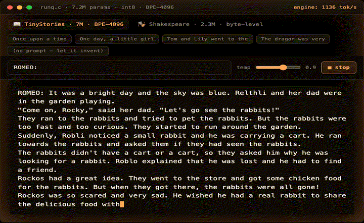

# 🔥 PROMETHEUS — a language model from scratch in C

> *"Yes, and besides, I gave them fire."* — Prometheus, in Aeschylus, *Prometheus Bound* (5th c. BC)

A Llama-2-style transformer written from scratch in ~600 lines of pure C — RMSNorm,
rotary position embeddings, multi-head attention with a KV cache, SwiGLU, a BPE
tokenizer and a top-p sampler. Trained from random weights by its own from-scratch
PyTorch twin, exported to a flat binary of floats, int8-quantized, and running
**live in your browser** via WebAssembly.

Six self-trained models ship in the demo, switchable live in the same C engine: three
alignments of the same instruct model — **DPO**, **PPO**, and **RLOO** (a reward model + RL) —
the **instruction-tuned (SFT)** model they came from (a live four-way contrast on preference
alignment), their shared **7M-parameter TinyStories base** (trained on ~300 MB with a
from-scratch 4096-vocab BPE tokenizer), and the original **2.3M byte-level Shakespeare** model.

**▶ Live demo + annotated walkthrough: [mikebertin.github.io/prometheus](https://mikebertin.github.io/prometheus/)**



No inference libraries, no frameworks, no API calls. Every token is a full forward
pass through the transformer, hand-written in one C file you can read in an evening.

```
Once upon a time, there was a little dog named Spot. He was going to the park
with his family. When they got there, Spot saw a big slide. He wanted to go on
it, but he was scared. His mom said, "Don't be scared, Spot." So he climbed the
ladder, slid down, and laughed.
```
*— 7M parameters, trained on TinyStories, running int8 in the browser*

## What's here

```
src/run.c                the entire inference engine (~600 lines, heavily commented)
src/runq.c               the same engine with int8-quantized weights (Q8_0)
src/model.py             the PyTorch training-time twin — mirrors run.c exactly
src/train.py             trains Shakespeare (bytes) or TinyStories (BPE, memmap)
src/export.py            serializes weights in the exact order run.c mmaps them
src/tokenizer_export.py  byte-level tokenizer (vocab 259) in run.c's format
src/bpe.py               from-scratch byte-level BPE — trains merges, run.c's format
src/prepare_data.py      tokenizes a corpus once into a uint16 memmap for training
src/finetune.py          instruction fine-tune (SFT) — chat template + loss masking
src/gen_prefs.py         builds on-policy preference pairs (RLAIF judge) for DPO
src/dpo.py               Direct Preference Optimization — policy vs frozen reference
src/ppo.py               PPO (the RLHF path DPO replaced) — rollouts + critic + GAE + clip
src/rm.py                reward model — Bradley-Terry on the preference pairs
src/rloo.py              RLOO (REINFORCE Leave-One-Out) against the reward model
src/web_api.c            thin emscripten wrapper — the same run.c, compiled to WASM
web/                     the live demo page + walkthrough (tracked in full,
                         including both trained models, so it deploys as-is)
```

The architecture, in the order `forward()` runs it:

```
token id ─► embedding ─► ┌─ per layer ×6 ──────────────────┐ ─► RMSNorm
                         │  RMSNorm → attention (+KV) → add │    ─► classifier
                         │  RMSNorm → SwiGLU          → add │    ─► logits
                         └─────────────────────────────────┘    ─► sample → loop
```

## Run it

```sh
make                       # optimized native build (clang, -O3): run + runq

# instant gratification: both trained models ship int8-quantized in web/models/
./runq web/models/tinystories_q80.bin -z web/models/tinystories_tokenizer.bin \
  -t 0.85 -i "Once upon a time"
./runq web/models/shakespeare_q80.bin -z web/models/byte_tokenizer.bin \
  -t 0.8 -i "ROMEO:"

# or the classic llama2.c validation target — Karpathy's TinyStories model:
curl -L -o models/stories15M.bin \
  https://huggingface.co/karpathy/tinyllamas/resolve/main/stories15M.bin
curl -L -o models/tokenizer.bin \
  https://github.com/karpathy/llama2.c/raw/master/tokenizer.bin
make demo
```

## Train your own

```sh
python3 -m venv .venv && .venv/bin/pip install torch numpy
curl -L -o data/input.txt --create-dirs \
  https://raw.githubusercontent.com/karpathy/char-rnn/master/data/tinyshakespeare/input.txt
make train                 # ~6 minutes on Apple silicon → models/shakespeare.bin
make bard                  # hear your own bard speak
make web                   # rebuild the WASM demo with your weights (needs emscripten)
```

Training deliberately shows its work: loss starts at ln(vocab) — pure guessing — and
the demo page charts the real run. On the tiny Shakespeare corpus you can watch
validation loss turn up while training loss keeps falling (overfitting, live); the
shipped checkpoint is the early-stopped one from the bottom of the valley.

### Scale up: TinyStories + a real BPE tokenizer

```sh
# 1. a from-scratch byte-level BPE tokenizer (256 bytes → 4096-vocab merges)
curl -L -o data/tinystories_valid.txt --create-dirs \
  https://huggingface.co/datasets/roneneldan/TinyStories/resolve/main/TinyStories-valid.txt
.venv/bin/python src/bpe.py --data data/tinystories_valid.txt --vocab 4096

# 2. tokenize the corpus once into a uint16 memmap, then train a ~7M model
.venv/bin/python src/prepare_data.py                # -> data/tinystories_{train,val}.bin
.venv/bin/python src/train.py \
  --train-bin data/tinystories_train.bin --val-bin data/tinystories_val.bin \
  --merges models/tinystories.merges \
  --dim 288 --layers 6 --heads 6 --hidden 768 --vocab 4096 --iters 6000 \
  --out models/tinystories.bin --ckpt models/tinystories.pt
make stories                                        # real words, whole stories
```

Because run.c's `encode()` is already a greedy "merge the highest-scored adjacent
pair" loop — which *is* BPE — teaching it a real tokenizer needed **zero C changes**:
`bpe.py` just writes the learned merges into the same `tokenizer.bin` format with
`score = -rank`, and the engine reproduces our tokenization exactly. "Once upon a
time" goes from 16 byte-tokens to ~4, so the model's 256-token context reaches four
times deeper into a story.

### Instruction fine-tune: from continuing to following

```sh
# turns the base model into one that follows an instruction (chat template + SFT)
.venv/bin/python src/finetune.py                    # -> models/tinystories_instruct.bin
make chat                                            # "Write a story using the words: …"
```

The base model *continues* text; the fine-tuned one *follows* a prompt. `finetune.py`
does supervised fine-tuning from the pretrained checkpoint using a plain-text chat
template (`User: … / Assistant: …`) and — the one new idea — **loss masking**: only
the response tokens count toward the loss (prompt positions are set to `-100`, which
`cross_entropy` ignores), so the model learns to *answer*, not to echo the question.
The instruction data is synthesized from the corpus itself (extract a story's content
words → "write a story using these words"), which makes it in-domain and verifiable:
finetune.py reports what fraction of requested words actually show up. Still zero C
changes — the template is text, BOS still ends the turn. At 7M params it's a
demonstration of the *mechanism*, not an assistant.

### Preference alignment: DPO (the RLHF stage)

```sh
# 1. build on-policy preference pairs judged by "did it use the words?"
.venv/bin/python src/gen_prefs.py --prompts 1200 --k 8   # -> data/prefs.jsonl
# 2. Direct Preference Optimization from the SFT model
.venv/bin/python src/dpo.py --prefs data/prefs.jsonl     # -> models/tinystories_aligned.bin
```

SFT taught the model to answer; **alignment** teaches it which answer is *better* — the
stage that turns an instruct model into an assistant. We aim it at Phase 6's honest
weakness (~24% word-inclusion). `gen_prefs.py` samples K completions from the SFT model
and pairs the one using the most requested words (*chosen*) against the fewest
(*rejected*) — a programmatic judge, so this is **RLAIF**, but the optimizer is identical.
`dpo.py` runs **DPO**: a trainable *policy* and a frozen *reference* (the SFT model), with
one line of loss that rewards only the preferences the reference didn't already hold — no
reward model, no PPO loop. Word-inclusion climbs measurably; the demo's 🎯 Aligned vs 💬
Instruct switch is a live A/B on the same words. Watch for the *alignment tax* — push too
hard and the policy reward-hacks fluency away. Zero C changes; DPO only moves the weights.

### The road not taken: PPO (`ppo.py`)

```sh
# the classic RLHF algorithm DPO replaced — on-policy RL from the SFT model
.venv/bin/python src/ppo.py --iters 50    # -> models/tinystories_ppo.bin
```

DPO is a shortcut around **PPO** (the InstructGPT recipe). `ppo.py` builds the full thing
so you can compare: same reward, same frozen reference, but now a real reinforcement-learning
loop — the policy generates **rollouts**, a **value head** (critic) scores them, **GAE** turns
rewards into advantages, and a **clipped surrogate** objective updates the policy with a KL
penalty to the reference. Five moving parts regenerated every iteration, versus DPO's one loss
over a static file. On the same held-out test: **SFT 22% → DPO 45% → PPO ~22%** — and that flat
PPO number is the honest lesson. Across three configs, PPO was either stuck (stable settings) or
unstable (aggressive ones: entropy blew up, reward fell); none beat DPO's robust *first-try*
doubling. PPO isn't incapable — it's the ChatGPT algorithm — it's *finicky*: high-variance policy
gradient vs DPO's low-variance contrastive loss, at ~20× the wall-clock. That's precisely why DPO
replaced it for straightforward preference alignment. The demo's 🎯 Aligned (DPO) vs 🕹️ PPO switch
is the live contrast. Still zero C changes: the critic is discarded, only the policy ships.

### RLHF done right — reward model + RLOO (`rm.py` + `rloo.py`)

```sh
.venv/bin/python src/rm.py --epochs 8       # train a reward model on the pref pairs (Bradley-Terry)
.venv/bin/python src/rloo.py --iters 40     # REINFORCE Leave-One-Out against it -> models/tinystories_rloo.bin
```

Phase 8's PPO lacked the two things real RLHF has: a **learned reward model** and a **low-variance
estimator**. `rm.py` trains the RM on the *same* preference pairs DPO used (Bradley-Terry loss);
`rloo.py` runs **RLOO** — no critic, no GAE, no clipping, just a leave-one-out baseline over *k*
samples per prompt. And the result is the best lesson in the repo: **SFT 22% → PPO 22% → RLOO 24%
→ DPO 45%.** RLOO's machinery worked perfectly — the reward-model score *tripled* and KL *exploded
9×* — but word-inclusion barely moved and the outputs degraded into repetition. The policy **hacked
the weak (~61%) reward model** instead of using the words: **reward-model overoptimization** (Goodhart's
law), the central pitfall of RLHF. The punchline: **DPO has no reward model to hack** — which is
exactly why it won. Switch 🕹️ PPO vs 🎁 RLOO live to see the RL machinery work and the weak RM break it.

## int8 quantization (`runq.c`)

The sibling engine stores every matmul weight as **Q8_0**: int8 values plus one
fp32 scale per group of consecutive values (`scale = max|w|/127`). Activations
quantize on the fly; the hot inner loop runs integer multiplies with an int32
accumulator. Norms, the KV cache and everything between ops stay fp32.

matmul is memory-bandwidth-bound, so 1-byte weights ≈ 4× less traffic:
the Shakespeare model drops 9.1→2.4 MB and roughly doubles in speed;
stories15M drops 60.8→17.1 MB. The live demo serves the quantized model —
that 2.4 MB download is what's generating in your browser.

```sh
.venv/bin/python src/export.py models/ckpt.pt models/shakespeare_q80.bin --q80
make bardq

# export.py also quantizes legacy fp32 .bin files directly — no .pt needed:
.venv/bin/python src/export.py models/stories15M.bin models/stories15M_q80.bin --q80
./runq models/stories15M_q80.bin -z models/tokenizer.bin -i "Once upon a time"
```

One hard-won detail: quantization groups must align with matrix rows, so the
exporter shrinks the group size until it divides `dim` and `hidden_dim` —
at GS=64 a dim-288 model reads its neighbours' scales on every odd row and
emits intermittent junk while staying eerily fluent. `runq.c` refuses such
checkpoints loudly rather than generating beautifully wrong Shakespeare.

## The interesting constraint

`model.py` and `run.c` are the same model written twice, and the exported binary is
their handshake. Five numbers have to agree or the model produces fluent garbage —
the file loads fine, the math runs fine, every output is subtly wrong:

| knob | value |
|---|---|
| RMSNorm epsilon | `1e-5` |
| RoPE base | `10000` |
| RoPE pairing | **adjacent** dims `(i, i+1)` — not HF's rotate-half |
| attention scale | `1/√head_size` |
| classifier | tied to the embedding table (positive `vocab_size` in the header) |

The two implementations agreeing — coherent text out of the C engine — *is* the
correctness proof. That's also why the byte-level tokenizer exists: vocab = 3
specials + all 256 bytes, so there is nothing to train and run.c's existing BPE
machinery works unchanged (it simply finds nothing to merge).

## Why "Prometheus"

Prometheus stole fire from the gods and handed it to humanity — the original
technology transfer. Language models can feel similarly god-given: sealed artifacts
you consume through an API. Writing one from scratch, down to the dot products, is
taking the fire apart to see how it burns. The name is the thesis: this stuff is
knowable, and it fits in one C file.

## Credits

- [Andrej Karpathy's llama2.c](https://github.com/karpathy/llama2.c) — the blueprint
  and the checkpoint format this engine speaks; his TinyStories checkpoints were the
  validation oracle for the forward pass.
- ["Attention Is All You Need"](https://arxiv.org/abs/1706.03762) (Vaswani et al., 2017)
  and the [Llama 2 paper](https://arxiv.org/abs/2307.09288) (Touvron et al., 2023) for
  the architecture.
- tiny-Shakespeare corpus via Karpathy's char-rnn.

MIT — see [LICENSE](LICENSE).
